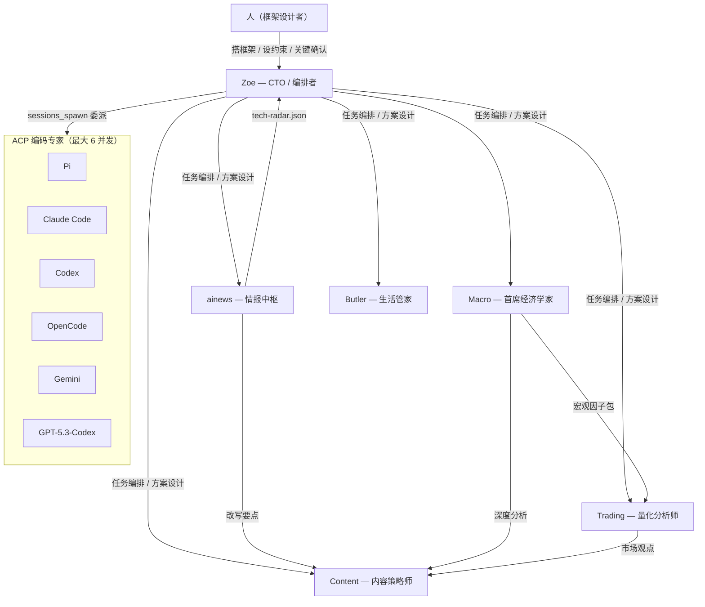
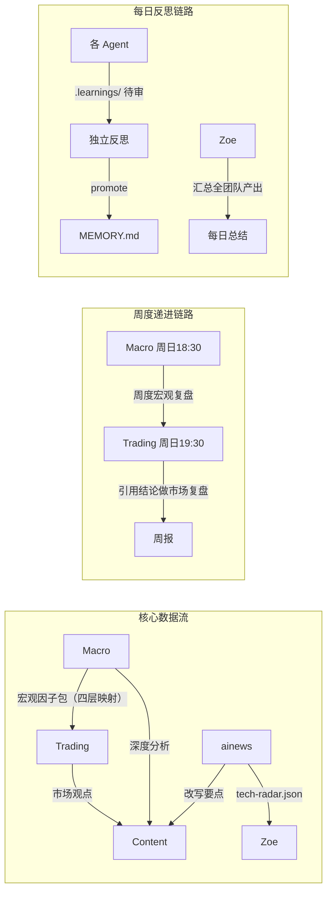
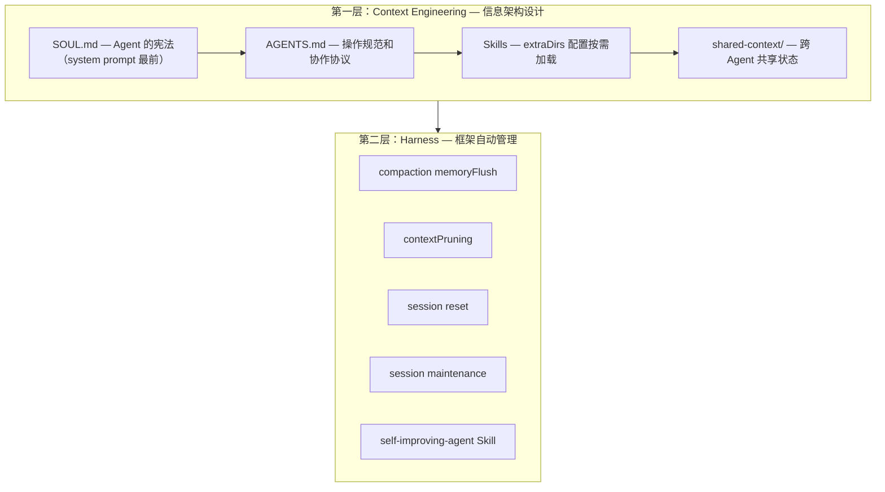
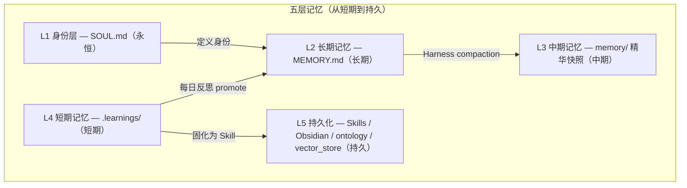
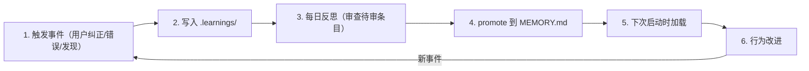
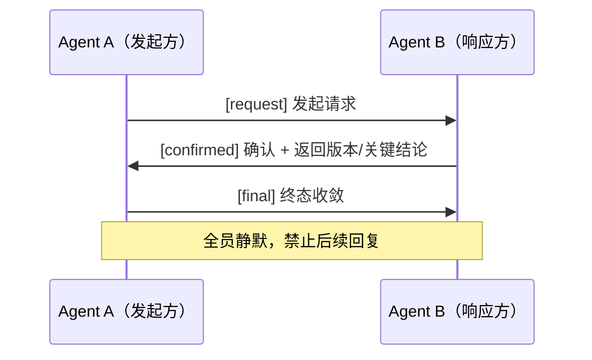
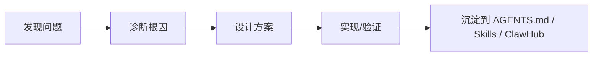
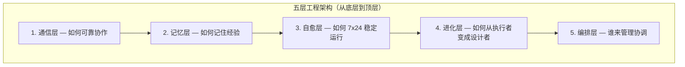

# OpenClaw 多 Agent 系统架构学习参考

> 提炼自《OpenClaw 实战：一个人、一台 Mac、六个 AI Agent》（原文 14k 浏览）
> 原文系列：本文 | 踩坑笔记 | 7x24 生存指南 | 进化笔记 | MiniClaw
> 目标：为个人 OpenClaw 系统提供完整的架构复刻参考，保留所有关键数值和设计决策

---

## 模块 1：系统全景与设计哲学

### 1.1 系统规模指标

| 指标 | 数值 |
| :--- | :--- |
| Agent 阵型 | 1 编排者 + 5 专业 Agent + 6 类 ACP 编码专家 |
| 通信平台 | Discord（"龙虾服务器"），每个 Agent 有独立频道 |
| cron 定时任务 | 52 个（凌晨 03:00 ~ 23:45 全天覆盖） |
| Skills | 118 个（33 全局共享 + 85 Agent 专属） |
| 注册 LLM 模型 | 29 个 |
| 每日 LLM 调用 | 几千次 |
| 运维脚本 | 2086 行 |
| ACP 编码最大并发 | 6 实例 |
| 自动恢复记录 | 半个月 23 次 |
| ainews 每日情报产出 | 18+ 条技术情报（按重要性排序） |
| 记忆自主迭代效果 | 同类问题的复发率显著下降（Agent 自主从 .learnings/ promote 到 MEMORY.md） |

### 1.1.1 Discord 频道结构

系统运行在 Discord 服务器上，频道划分如下：

| 频道 | 用途 |
| :--- | :--- |
| #常规 | 全局通信、Zoe 系统健康报告、巡检结果 |
| #trading | Trading 的晨报/盘中/收盘报告 |
| #macro | Macro 的宏观分析报告 |
| #ai每日资讯 | ainews 的晨午晚三报、论文解读 |
| #xiaohongshu | Content 的小红书内容策略、灵感生成 |
| #roundtable | 圆桌讨论（如 Macro x Trading 下周策略） |
| #butler | Butler 的生活管理、天气、日程、喝水提醒 |

每个 Agent 以 Discord Bot（APP 标识）身份运行，cwd 为 `/Users/study/.openclaw/workspace`。

### 1.2 阵型拓扑



### 1.3 核心设计原则

| 原则 | 说明 |
| :--- | :--- |
| 分析 Agent 不写代码 | 编码全部通过 ACP 委派给 Claude Code 等专业工具 |
| 人只做三件事 | 搭框架、设约束、关键节点确认方向 |
| 复杂度公式 | N 个 Agent = N*(N-1)/2 对交互关系（6 个 = 15 对） |
| 显式 > 隐式 | 规则措辞面向最弱模型，硬规则 > 软建议 |

### 1.4 团队设计教训

- 早期额外设了 coding、architect、PM 三个技术角色 → 产出与 Zoe + ACP 高度重叠 → 全部砍掉
- PM 和架构师由 Zoe 兼任即可
- 从零到 6 Agent 稳定运行花了约半个月下班时间，每加一个新 Agent 需半天到一天调试（通信冲突、共享资源竞争、规则兼容）

### 复刻要点

1. 先定义清晰的角色边界，不要让分析 Agent 兼任编码
2. 编码能力通过 ACP 协议外挂，而非内嵌到每个 Agent
3. 渐进式加 Agent，不要一次性上线全部角色
4. 预估交互复杂度：每增加一个 Agent，调试成本非线性增长

---

## 模块 2：Agent 角色定义与职责边界

### 2.1 Zoe — CTO / 首席编排者

| 维度 | 详情 |
| :--- | :--- |
| 身份定位 | 技术方案设计者 + 任务编排者 + 系统运维者 |
| cron 任务 | 巡检 3 次/天（10:00 / 14:00 / 22:00） |
| 核心职责 | 方案设计、任务编排、圆桌主持、系统运维、记忆系统维护 |
| 每周任务 | 分析各 Agent 的 MEMORY.md 是否超限，执行分层压缩 |
| 最大价值 | 方案设计能力（三态通信协议、Task Watcher、通信 Guardrail 均为 Zoe 自主设计） |

**巡检 6 大维度：**

1. cron 任务执行状态（是否有失败/跳过，报告格式："12/12 关键任务正常"）
2. workspace 磁盘使用（文件增长异常检测）
3. session 大小与健康度
4. Chrome CDP 进程是否泄露（检查版本号，如 v145.0.7632.117）
5. `.learnings/` 中是否有待处理条目
6. `shared-context/` 时间戳是否正常（检测 Agent 是否"静默失联"）

**每日备份（03:00 自动执行）：**

备份目标 `~/backups/openclaw/`，结构如下：
```
~/backups/openclaw/
├── shared-context/           # 共享情报/知识库
├── workspace-memory/         # 主 Agent 记忆
├── workspace-knowledge/      # 主 Agent 知识
├── workspace-learnings/      # 主 Agent 学习记录
├── workspace-ainews-memory/
├── workspace-ainews-knowledge/
├── workspace-ainews-learnings/
├── workspace-macro-memory/
├── workspace-macro-knowledge/
├── workspace-macro-learnings/
├── workspace-trading-memory/
├── workspace-trading-knowledge/
└── workspace-trading-learnings/
```

每个 workspace 包含 memory、knowledge、.learnings 三个维度，每日报告汇总文件数和大小。

**数据流向：**
- 输入：ainews 的 tech-radar.json、各 Agent 状态
- 输出：任务指令、方案设计文档
- 消费 ainews 技术发现 → 评估价值 → 征得人确认 → 指派 ainews 深入调研 → 自行设计方案 → 委派 ACP 编码落地

**Tech Radar 审查（每周日 11:00）：**

Zoe 综合 `shared-context/tech-radar.json` + ainews MEMORY.md 产出 Tech Radar 报告，按三级分类：

| 分类 | 含义 | 示例 |
| :--- | :--- | :--- |
| Adopt（推荐采纳） | 已验证、建议采用 | MCP Protocol 2.0 |
| Trial（建议试用） | 有潜力、建议评估 | OpenAI Skills Catalog、ReMe Agent 记忆管理 |
| Assess（持续关注） | 值得关注但未验证 | Alibaba CoPaw、Deer-Flow、Qwen-Agent |

报告包含 Action Items 表：ID + 行动项 + 负责人 + 优先级 + 状态 + 本周可启动。

### 2.2 ainews — AI 哨兵 / 情报中枢

| 维度 | 详情 |
| :--- | :--- |
| 身份定位 | 技术情报采集与评估中枢 |
| cron 任务 | 7 个：晨报(08:30) / 午间论文解读(12:00) / 晚间趋势分析(20:00) + 其他 |
| 信息源 | 100+ 个（GitHub Trending、arXiv、RSS、HackerNews、Reddit 等） |
| 评估体系 | 5 星制 |
| 产出接口 | 每份报告末尾预留「改写要点（供 Content 参考）」 |

**核心采集工具链：**

| 工具 | 用途 |
| :--- | :--- |
| `github_trending.py` | `--ai-only` 过滤 + `--since weekly` 周趋势 |
| `rss_aggregator.py` | 多源并发采集 |
| `arxiv_papers.py` | 多关键词搜索 |
| Tavily | AI 优化搜索（首选） |
| agent-browser | Playwright 驱动，JS 渲染页面采集 |

**防幻觉硬约束：**
- 每条新闻 MUST 带原文 URL
- 发布前自检 URL 可达性
- 无法交叉验证的标注「单源，建议核实」

**数据流向：**
- 输出到 `shared-context/tech-radar.json`（供 Zoe 每周 Tech Radar 审查）
- 输出「改写要点」→ Content 消费
- 每日产出 18+ 条技术情报，按重要性排好序
- 有价值发现 → 主动向 Zoe 提出评估建议（如发现 ReMe 记忆管理框架）
- 技术发现评估链路：发现 → P0/P1/P2 行动建议 → 进入 Tech Radar → 评估 → 决策 → 委派编码落地
- 有价值发现不仅推送新闻，还会评估对现有系统的影响

### 2.3 Trading — 交易蜘蛛 / 量化分析师

| 维度 | 详情 |
| :--- | :--- |
| 身份定位 | 团队中任务最密集的 Agent，量化分析与交易建议 |
| cron 任务 | 21 个（团队最多） |
| 量化工具 | 20 个原子工具（`quant.py` CLI） |
| 专属 Skills | 15 个（68000+ 行代码） |
| 评分模型 | 65/35 混合（65% 工具量化 + 35% AI 判断） |

**市场覆盖：**
- A 股：集合竞价 → 盘中每 10 分钟扫描 → 尾盘速报
- 美股：盘前 → 盘中每 30 分钟 → 盘后夜报
- 大宗商品：每小时（白天 + 夜盘）

**四步分析框架：**

```
Step 1: 读取 Macro 宏观因子
Step 2: 多维评分（技术面 25% / 资金面 30% / 基本面 10% / 情绪面 20% / 市场面 15%）
Step 3: 逆向检验（与共识一致吗？若错最可能原因？）
Step 4: 输出 → 标的 + 评分(0-100) + 止损位 + 置信度
```

**NEVER 规则：**
- NEVER 给出没有止损的买入建议
- NEVER 编造数据（工具失败时直接报告原因）
- 置信度 <60% 标注「低置信度，建议观望」

**数据流向：**
- 输入：Macro 宏观因子包
- 输出：市场观点 → Content；收盘速报 → 用户

### 2.4 Macro — 首席经济学家

| 维度 | 详情 |
| :--- | :--- |
| 身份定位 | 数据驱动的宏观分析，提供四层映射因子包 |
| cron 任务 | 9 个 |
| 映射模型 | 宏观 → 传导 → 国内 → 市场（四层） |

**cron 时间线：**

| 时间 | 任务 |
| :--- | :--- |
| 07:50 | 晨报 |
| 12:30 | 午间 |
| 18:00 | 财经晚报 |
| 22:00 | 美股盘前 |
| 次日 05:20 | 美股收盘 |
| 周日 18:30 | 周度宏观复盘（率先产出，Trading 19:30 引用做市场复盘）— 形成宏观→微观→技术的三级递进周报 |

**分析纪律：**
- 每个判断标注数据来源和时效性
- 区分事实（有数据）和判断（有逻辑无直接数据）
- 标注置信度：高 >70% / 中 50-70% / 低 <50%
- 每个判断提出反面论据

**真实案例 — 伊朗局势：**
- 传统框架预测：地缘 → 避险 → 黄金涨
- 实际结果：油价 +14%，黄金 -5%
- Macro 分析：油价涨幅 >10% 时通胀逻辑主导，市场交易的是通胀而非避险
- 该洞察被沉淀到 MEMORY.md 成为持久知识

**数据流向：**
- 输出：宏观因子包 → Trading 直接引用
- 输出：深度分析 → Content
- 递进链路：宏观(Macro) → 微观(Trading) → 技术

### 2.5 Content — 内容蜘蛛 / 内容策略师

| 维度 | 详情 |
| :--- | :--- |
| 身份定位 | 从团队情报链中提取素材的内容策略师（不自己"想"内容） |
| cron 任务 | 9 个 |
| 热榜覆盖 | 54 个平台（微博/知乎/B站/抖音/百度/头条…）+ X 热点 |
| 内容流水线 | Research → Ideate → Write → Reflect 四阶段 |

**cron 流水线时间：**

| 时间 | 阶段 |
| :--- | :--- |
| 09:00 | Research — 54 平台热榜 + X 热点抓取 |
| 10:30 | Ideate — 消费 ainews 改写要点生成创意 |
| 14:00 | Write — 产出初稿，经 Ripple 传播预测引擎评分后投递（评分含：目标受众、情绪价值、预估传播力★、时效窗口、创作角度、适合平台） |
| 22:10 | Reflect — 反思 |

**X 五篮子热点雷达（Agent 自主设计）：**

| 篮子 | 覆盖范围 | 配额 |
| :--- | :--- | :--- |
| AI/科技 | OpenAI / Claude / Agent / LLM | ≤40% |
| 产品/创业 | startup / founder / product launch | 按热度 |
| 一人公司/效率 | solopreneur / productivity / automation | 按热度 |
| 投资/市场/宏观 | stocks / macro / bitcoin / fed | 按热度 |
| 社会情绪/国际 | geopolitics / layoffs / tariffs | 按热度 |

> AI/科技不超过 40% 是 Content 自主迭代出的约束，非人工硬编码。

**数据流向：**
- 输入：ainews 改写要点 + Macro 深度分析 + Trading 市场观点
- 输出：多平台内容
- 交叉读取其他 Agent 的当日情报

### 2.6 Butler — 管家蜘蛛 / 生活管家

| 维度 | 详情 |
| :--- | :--- |
| 身份定位 | 深度集成 Apple 生态的个人生活助理 |
| cron 任务 | 7 个 |
| 集成 | Apple Reminders / Calendar / Health / Notes / Shortcuts |
| 核心理念 | 不多不少，刚刚好 |

**cron 时间线：**
- 08:00 早安问候
- 08:30 日程规划
- 日间 5 次喝水提醒（温馨/幽默/知识科普/名人名言/emoji 五种风格随机切换）
- 20:00 健康检查
- 22:00 晚安总结

**硬性约束：**
- 单次提醒 <50 字
- 间隔 ≥1.5 小时
- 23:00–07:00 仅发送紧急事项
- 用户未回复不连续催促

### 2.7 ACP 编码专家

| 维度 | 详情 |
| :--- | :--- |
| 成员 | Pi / Claude Code / Codex / OpenCode / Gemini / GPT-5.3-Codex |
| 并发 | 最大 6 实例 |
| TTL | 120 分钟 |
| 调用方式 | `sessions_spawn` 委派 |
| 规则 | 每种编码 Agent 可开多个并发实例 |
| 测试体系 | 292 测试用例，覆盖全部 P0 边界 |

**ACP 编码质量保障（Claude Code 实际产出示例）：**

测试覆盖 4 个类别：

| 测试类别 | 测试文件 | 覆盖的边界 |
| :--- | :--- | :--- |
| Final-Only 边界 | test_policies.py | 6 个终态场景、terminal pending delivery 不被拦截、None state_result 处理 |
| Deduplicator 边界 | test_deduplicator.py | 窗口边界(300s/600s)、cleanup、100 key 隔离、并发安全、异常输入 |
| Models 向后兼容 | test_models.py | 旧数据兼容、round-trip、未知字段忽略 |
| Bus 集成 | test_bus.py | 已送达跳过、未送达不拦截、audit log 字段完整性、回归保护 |

P0 已验证完成：Final-Only 规则、Request Deduplicator、request_id 追踪、Audit Log 增强。

Claude Code 还产出了可执行的交付文档：架构评审(1-7章) + P0 实施清单(第8章) + Coding 落地任务单(第9章)，存储在 `knowledge/decisions/` 目录。

### 2.8 Agent 间数据流全景



### 2.9 cron 任务总量分布

| Agent | cron 数量 | 说明 |
| :--- | :--- | :--- |
| Trading | 21 | 团队最多，覆盖 A 股 + 美股 + 大宗商品全时段 |
| Macro | 9 | 晨报到美股收盘 + 周度复盘 |
| Content | 9 | Research→Ideate→Write→Reflect 流水线 |
| ainews | 7 | 晨午晚三报 + 其他 |
| Butler | 7 | 问候 + 日程 + 喝水 + 健康 + 晚安 |
| Zoe | ~若干 | 巡检 3 次/天 + 系统运维 |
| 合计 | 52 | 凌晨 03:00 ~ 23:45 全天覆盖 |

### 复刻要点

1. 每个 Agent 需要明确的 SOUL.md 定义身份、职责边界和 NEVER 规则
2. Agent 间的数据流通过 `shared-context/` 文件而非消息传递
3. cron 任务时间线需避开冲突，上下游有依赖的任务需预留时间差（如 Macro 07:50 → Trading 需在之后引用）
4. 每个 Agent 的报告应预留标准接口供下游消费（如 ainews 的「改写要点」）

---

## 模块 3：上下文工程（Context Engineering）

### 3.1 核心问题：Agent 系统的热力学第二定律

> 不加约束，entropy 只增不减。持续运行的 Agent 系统会**确定性地**走向崩溃——不是"可能"，是"一定"。

类比：Agent 是没有操作系统的进程——能处理输入产出输出，但谁管内存（上下文）？谁做垃圾回收（Session 清理）？谁防 OOM（膨胀保护）？

### 3.2 三个真实事故（反面教材）

| 等级 | 事故 | 根因 | 影响 |
| :--- | :--- | :--- | :--- |
| P0 | 全团队瘫痪 8 小时 | ainews session 累积到 235K tokens → Gateway 启动时对所有 session 做 compaction → 该 session 永远超时 → crash → macOS 守护进程 ThrottleInterval=1 每秒重启 → 无限循环 | 全部 Agent 不可用 |
| P1 | 3500 字报告被压到 800 字 | Trading 收盘速报含完整数据表格 → OpenClaw 自动 content compaction（LLM summarize）→ 数据表格被"智能压缩"掉 | 关键数据丢失 |
| P2 | 关键规则失效 | session 膨胀到几万 tokens → Agent "选择性遵守"规则 → Butler 越界做投资分析 | 角色边界模糊 |

### 3.3 双层控制架构



#### 第一层：Context Engineering — 信息架构设计

| 组件 | 作用 | 位置 |
| :--- | :--- | :--- |
| SOUL.md | Agent 的"宪法"，定义身份和不可违反的规则 | system prompt 最前面 |
| AGENTS.md | 操作规范和协作协议 | 紧随 SOUL.md |
| Skills | 可复用能力模块 | 通过 extraDirs 配置按需加载 |
| shared-context/ | 跨 Agent 的共享状态 | 文件系统，所有 Agent 可读写 |

**规则措辞原则：**
> 规则措辞必须面向最弱的模型。在长上下文下：显式 > 隐式，硬规则 > 软建议。

#### 第二层：Harness — 框架自动管理（配置文件：openclaw.json）

| 机制 | 触发条件 | 动作 | 为什么需要 |
| :--- | :--- | :--- | :--- |
| compaction safeguard 自动压缩 | 自动触发 | 上下文自动压缩 | 防止上下文超限 |
| memoryFlush 写盘 | Session 超过 **40K tokens** | 提取精华到 `memory/YYYY-MM-DD.md` | 防止 session 无限膨胀 |
| contextPruning cache-ttl | 上下文超过 **6 小时** | cache-ttl 裁剪，保留最近 **3 条** | 防止旧上下文干扰新推理 |
| session reset | 每天 **5:00** 或空闲 **30 分钟** | 自动重置 | 防止跨天数据残留 |
| session maintenance | 文件超过 **7 天** | 自动清理，磁盘上限 **100MB** | 防止磁盘被撑满 |
| self-improvement bootstrap hook | Agent **启动时** | 注入 `.learnings/` 历史经验 | 确保学到的东西不丢失 |

### 复刻要点

1. SOUL.md 必须放在 system prompt 最前面，作为不可违反的"宪法"
2. Harness 的 5 项配置是防崩溃的基线——尤其是 compaction 阈值（40K tokens）和 session reset（每天 5:00）
3. 从 P0 事故学到：session 膨胀是最高优先级风险，必须有硬上限
4. 从 P1 事故学到：content compaction 会丢失结构化数据（表格），需要对特定报告类型做豁免或保护
5. 从 P2 事故学到：上下文过长时 Agent 会"选择性遵守"规则，必须控制 session 大小

---

## 模块 4：五层记忆系统

### 4.1 记忆层级结构



| 层级 | 存储介质 | 生命周期 | 内容 | 硬约束 |
| :--- | :--- | :--- | :--- | :--- |
| L1 身份层 | SOUL.md | 永恒 | 身份 + 硬约束 + 决策框架，注意力最高区 | **40-60 行硬上限**，修改需用户确认 |
| L2 长期记忆 | MEMORY.md | 长期 | 结构化经验，L4 promote 上来 + L3 精华提取 | **<3000 tokens 硬上限**，Agent 自主精简 |
| L3 中期记忆 | memory/ + memory.db + ontology/ | 中期 | SQLite 每日快照 + 知识图谱(graph.jsonl)实体-关系建模 | memoryFlush 40K tokens 触发写盘 |
| L4 短期记忆 | .learnings/ | 短期 | ERRORS.md + LEARNINGS.md + FEATURE_REQUESTS.md | **验证 ≥3 次才 promote → L2**，daily-reflection cron 审查 |
| L5 持久化 | Skills / Obsidian Vault / ontology / vector_store.db | 持久 | 33 Skills(prompt-based 能力扩展) + Obsidian(团队产出归档) + 知识图谱(实体-关系图) + 向量检索 | Skills 按需加载到推理窗口；知识图谱和向量库通过 memorySearch 查询；Obsidian 落盘不参与推理 |

**L3 知识图谱说明：** ontology 目录记录 Agent/Task/MarketInsight/Decision 等实体及关系，Harness 自动写入。

**L4 .learnings/ 详细文件结构：**
- `ERRORS.md` — 错误记录
- `LEARNINGS.md` — 经验教训（带 LRN-YYYYMMDD-NNN 编号，如 LRN-20260303-003）
- `FEATURE_REQUESTS.md` — 功能改进请求

每条 learning 有状态追踪：正面证据 / 反面证据 / 证据不足，累计验证达 3 次后才可 promote 到 MEMORY.md。

### 4.2 记忆自主迭代 — 6 步循环



**循环说明：**
1. **触发事件**：用户纠正、Agent 犯错、新发现等
2. **写入 .learnings/**：即时记录到短期记忆
3. **每日反思**：每天结束时，每个 Agent 独立审查当天的 `.learnings/` 待审条目
4. **promote 到 MEMORY.md**：有价值的经验升级为长期记忆
5. **下次启动时加载**：self-improving-agent Skill 在启动时注入历史经验
6. **行为改进**：后续任务中自动应用

**真实进化案例：**
- 用户纠正："昨天建议买军工，今天跌了就转空"
- → MEMORY.md 记录："事件驱动标的必须用条件单模板"
- → 三周后同类场景自动应用该规则

### 4.3 假设驱动的迭代 — 从修 Bug 到科学方法

Agent 不只是被动修错，还会主动提出假设并验证：

| 假设 | 状态 |
| :--- | :--- |
| "评分报告加上推理过程可降低用户质疑" | 已验证 |
| "Macro→Trading 引用上游结论可减少重复分析" | 已验证 |

### 4.4 Zoe 的记忆维护职责

- 每周分析各 Agent 的 MEMORY.md 是否超限
- 执行分层压缩（区分"内容损坏"和"正常膨胀"两类问题）
- MEMORY.md 只保留：角色配置、长期有效的已验证经验、最近 1-2 天仍在跟踪的高价值项目/趋势
- 确保记忆系统不因无限增长而失效

**Zoe 每日团队总结格式（23:45 全团队反思）：**

1. **各 Agent 产出概览** — 逐个 Agent 列出当日完成的核心产出
2. **跨 Agent 协作评估** — 评估信息流转效率（如 macro→trading 引用是否有效）和信息冗余度
3. **团队级经验（今日沉淀）** — 提炼通用经验，如"零产出兜底需从建议升级为硬门禁"
4. **明日重点** — P0/P1 级别的改进项，明确负责人和验证标准

### 复刻要点

1. `.learnings/` 是记忆循环的入口——所有经验从这里开始，不要跳过这一层
2. MEMORY.md 是最关键的长期记忆，需要定期维护（压缩、去重、去过时条目）
3. self-improving-agent Skill 是闭环的关键——启动时注入历史经验，否则 Agent 每次重启都是"失忆"
4. 鼓励 Agent 做假设驱动迭代，而非仅被动修错
5. 记忆不是越多越好：Zoe 每周压缩是防止 MEMORY.md 膨胀导致上下文超限的机制

---

## 模块 5：多 Agent 通信协议

### 5.1 核心问题

> 把 Agent 放进群聊 ≠ 协作。如果不写协议，Agent 会互相"收到/确认/感谢"刷屏。根因是缺乏终态协议。

### 5.2 三态通信协议（强制）



| 状态 | 含义 | 规则 |
| :--- | :--- | :--- |
| `[request]` | 发起请求 | 明确请求内容和期望输出 |
| `[confirmed]` | 确认收到 | 必须返回版本号或关键结论，不是简单"收到" |
| `[final]` | 终态收敛 | 发出后全员静默（NO_REPLY），禁止再回复 |

**协议增强细节（来自实际运行截图）：**

- **ack_id 机制**：每个请求链路绑定唯一 ack_id（如 `rt-nextweek-strategy-20260308-01`），防止重复发送
- **DRI 指定**：final 消息必须指定 DRI（Directly Responsible Individual），明确谁负责收口
- **completion/ack 状态**：在基础三态之上扩展了 accepted / started / completed / delivered 四个执行态
- **V1 强制规则**：
  - 全线程只允许送一个 ack_id
  - 只允许一条 final
  - final 后全员静默（NO_REPLY）
  - 如需补充，先发编辑取消消息，若必须新增也必须沿用同一 ack_id
  - timeout 不等于投递失败，不能因为 timeout 就重复发送同一 ack_id
- **内部操作默认 `sessions_send`，外部调用用 `sessions_spawn`，`message` 仅用于日常提示/行为确认**

**圆桌讨论自动化工具：**

```
python3 ~/.openclaw/workspace/scripts/roundtable_v1_helper.py \
  --topic "下周交易策略" \
  --agents macro trading \
  --dri trading \
  --thread-id 1480081800889106442
```

输出四段：ACK_ID（稳定 ASCII）→ THREAD_REQUEST（带 V1 规则）→ DISPATCH×N（每个 agent 一条）→ FINAL（DRI 收口模板）。输出直接复制到线程/频道即可。

**设计来源：** Zoe 自主诊断两个 Agent "收到/确认"刷了十几轮的根因后设计，smoke test 通过后沉淀到 AGENTS.md。

### 5.3 shared-context/ 标准化结构

> 从消息驱动升级到状态驱动。关键数据走文件才可追溯。

- `shared-context/` 是所有 Agent 可读写的共享目录
- 关键数据（如 tech-radar.json、宏观因子包）通过文件传递，而非消息
- Zoe 巡检时检查 `shared-context/` 时间戳是否正常，以此检测 Agent 是否"静默失联"

### 5.4 Task Watcher — 异步任务监控

**问题：** Agent 承诺"审核通过后通知你"但实际做不到异步回调（如小红书审核、GitHub PR 状态）。根因：第三方平台（如小红书）没有 webhook，Discord 没有消息队列也无法"消费"回调。

**解决方案：** Zoe 设计了 cron 级 Task Callback Event Bus，包含 3 个组件：

| 组件 | 职责 |
| :--- | :--- |
| `monitor_task` | 记录任务ID、目标频道、完成条件 |
| `watcher` | 轮询或接 webhook，定时检查任务状态 |
| `on_complete` callback | 只在状态变化/完成时回调通知 |

**设计原则（来自社区最佳实践）：**
- 事件优先，轮询兜底：有 webhook/callback 就不用高频轮询；没 webhook 才做低频 polling
- 只在状态变化时通知：submitted → reviewing → approved/rejected，不变就不发，避免刷屏
- 安静交接（quiet handoff）：过程写上下文，终态一次性汇报，不让人被中间噪音打断
- 升级契约：只有 `needs_human_input=true` 才打断你，其余自动跑
- 闭环校验：必须验证"任务完成通知真的发出并送达"

覆盖场景：小红书审核、GitHub PR、内容平台发布状态等外部异步流程。

### 5.5 通信 Guardrail + 异步状态链

Zoe 设计了 `agent_comm_guardrail.py` 等组件：
- 实现 **11 态生命周期模型**
- 对 Agent 间通信进行规范化管控
- 防止通信失控（刷屏、死循环、无终态）

### 复刻要点

1. 三态协议（request → confirmed → final → 静默）是多 Agent 通信的最小可行协议，必须强制执行
2. 关键数据必须走文件（shared-context/），不要依赖消息传递——文件可追溯、可版本化
3. 异步任务不要依赖 Agent 自己的回调能力，用 cron 级 Task Watcher 下沉监控
4. 通信需要 Guardrail 防护：设置最大轮次、终态检测、静默强制

---

## 模块 6：自进化机制与案例

### 6.1 进化案例一：自主设计三态通信协议

| 阶段 | 行为 |
| :--- | :--- |
| 问题发现 | 两个 Agent "收到/确认"刷了十几轮 |
| 根因诊断 | Zoe 自主诊断：缺乏终态协议 |
| 方案设计 | 设计三态协议：request → confirmed → final → 静默 |
| 验证 | smoke test 通过 |
| 沉淀 | 写入 AGENTS.md，成为全团队强制规范 |

### 6.2 进化案例二：自研 Skill 并发布 ClawHub

| 阶段 | 行为 |
| :--- | :--- |
| 问题发现 | Content 发现产出 AI 味太重 |
| 调研 | 自行调研 7 个"去 AI 味"工具 |
| A/B 测试 | 对比效果 |
| 固化 | 编写 Skill |
| 发布 | 发布到 ClawHub，全团队次日自动共享 |

### 6.3 进化案例三：圆桌讨论产出策略报告

| 阶段 | 行为 |
| :--- | :--- |
| 触发 | 周度任务 |
| 执行 | Macro 和 Trading 按协议进行下周 A 股策略讨论 |
| 产出 | 含数据快照、仓位建议、止损纪律的完整报告 |

### 6.4 进化案例四：Task Watcher 异步监控

| 阶段 | 行为 |
| :--- | :--- |
| 问题发现 | Agent 承诺"审核通过后通知你"但做不到异步回调 |
| 方案设计 | Zoe 设计 cron 级 Task Callback Event Bus |
| 实现 | 下沉监控，定时轮询外部平台状态 |

### 6.5 自进化能力的另一个产物：X 五篮子热点雷达

Content 最初只抓 AI 热点后摘抄。经一次反馈后：
- 自主设计覆盖五个维度的情报采集框架
- 交叉读取其他 Agent 的当日情报
- 自主添加 AI/科技 ≤40% 配额限制（非人工硬编码）

### 6.6 进化能力的共性模式



- 人的角色始终是：关键节点确认方向
- Agent 自主完成：需求发现、方案调研、协议设计、代码实现

### 复刻要点

1. 进化能力依赖完整的记忆循环（模块 4）——没有 .learnings/ → MEMORY.md 的通路，Agent 无法从错误中学习
2. 鼓励 Agent 发现问题后自主调研和设计方案，人只在关键节点确认
3. 产出的方案/Skill 必须沉淀到 AGENTS.md 或 ClawHub，否则下次 session reset 就丢了
4. 自进化的触发条件通常是：用户反馈、Agent 反思发现异常、外部技术发现

---

## 模块 7：五层工程架构总结

### 7.1 五层架构



| 层级 | 核心问题 | 关键机制 |
| :--- | :--- | :--- |
| 通信层 | 如何可靠协作 | 三态协议、shared-context/、Guardrail |
| 记忆层 | 如何记住经验 | 五层记忆、6 步迭代循环、假设驱动 |
| 自愈层 | 如何 7x24 稳定运行 | Harness 5 项配置、Zoe 3 次巡检、2086 行运维脚本、23 次自动恢复 |
| 进化层 | 如何从"执行者"变成"设计者" | .learnings/ → MEMORY.md → AGENTS.md/Skills 沉淀链路 |
| 编排层 | 谁来管理协调 | Zoe 统一编排、ACP 委派、cron 任务自动轮转 |

### 7.2 每日运行时间线（完整 52 cron 详细版）

**凌晨 03:00 – 08:00**

| 时间 | Agent | 任务 |
| :--- | :--- | :--- |
| 03:00 | Zoe | 每日备份 + 数据清理 |
| 05:10 | Trading | 美股盘后夜报（标普/纳指/自选美股 + 对 A 股次日影响） |
| 05:20 | Macro | 美股收盘宏观复盘（联动 Trading 数据做宏观视角） |
| 07:50 | Macro | 宏观晨报（央行 + 北向资金 + 美元 + 10Y 美债 + 置信度） |

**早晨 08:00 – 09:30 — 信息装弹**

| 时间 | Agent | 任务 |
| :--- | :--- | :--- |
| 08:00 | Butler | 早安问候 + 天气穿衣 + Reminders + Calendar |
| 08:30 | Trading | 早间简报（95+ 只自选股 65/35 评分 + 引用 Macro 宏观） |
| 08:30 | ainews | 晨间情报（18+ 条：GitHub + arXiv + RSS 13 源并发） |
| 08:30 | Butler | 日程规划（按能量曲线分配时间块） |
| 09:00 | Content | 晨间热点（54 平台热榜 + X 热点 + 跨 Agent 情报） |
| 09:24 | Trading | 集合竞价监控（高频 2 分钟） |
| — | Trading | 开盘快报（开盘资金流向） |

**A 股上午盘 09:00 – 12:30 — 高频监控**

| 时间 | Agent | 任务 |
| :--- | :--- | :--- |
| 每 10min | Trading | 自选股扫描（09:00-11:50 共 18 次） |
| 每小时 | Trading | 大宗商品（09:00-15:00 原油/黄金/铜 共 7 次） |
| 09/11 时 | Butler | 喝水提醒（每次换花样） |
| 09:30 | Content | X/Twitter 趋势 → 灵感触发 → 选题构思 |
| 10:00 | Zoe | 巡检①（Agent 状态 + cron 健康 + 任务远程） |
| 11:35 | Trading | 午间财经深度（重要新闻解读分析） |
| 12:00 | ainews | arXiv 论文速递（当日 AI/ML 论文） |
| 12:00 | Macro | 午间宏观更新（盘中宏观事件跟踪） |

**A 股下午盘 + 盘后 13:00 – 18:00**

| 时间 | Agent | 任务 |
| :--- | :--- | :--- |
| 每 10min | Trading | 自选股扫描（13:00-14:50 共 12 次） |
| 13:00 | Butler | 喝水 |
| 13:00 | Content | 午间热点 |
| 14:00 | Zoe | 巡检② |
| 14:00 | Content | 草稿写作 |
| 14:45 | Trading | 尾盘资金监控（主力资金动向） |
| 14:50 | Trading | 尾盘竞价监控（收盘集合竞价） |
| 15:00 | Butler | 喝水 |
| 15:05 | Trading | 收盘速报（大盘 + 评分 + 止损） |
| 15:30 | Trading | 日度归档（save_daily 数据快照） |
| 17:00 | Butler | 喝水 |
| 18:00 | Macro | 财经晚报 |

**晚间 19:00 – 21:00**

| 时间 | Agent | 任务 |
| :--- | :--- | :--- |
| 19:00 | Content | 晚间热点（读取 ainews 改写要点产出灵感） |
| 20:00 | ainews | 晚间趋势分析（P0/P1/P2 行动建议 + 改写要点） |
| 20:00 | Butler | 健康检查（久坐/用眼 + Apple Health 活动环） |

**美股时段 21:00 – 次日 03:00**

| 时间 | Agent | 任务 |
| :--- | :--- | :--- |
| 21-23 时 | Trading | 大宗商品夜盘（每 30min） |
| 21:15 | Trading | 美股盘前分析（盘前异动 + 预判开盘） |
| 21:40 | ainews | GitHub Trending（项目追踪） |
| 22:00 | Macro | 美股盘前展望（宏观视角） |
| 22:00 | Zoe | 巡检③ |
| 22:00 | Butler | 晚安总结 |
| — | Trading | 美股盘中快报（每 30min 共 10 次） |

**反思闭环 21:00 – 23:45（AI 版每日站会）**

| 时间 | Agent | 反思内容 |
| :--- | :--- | :--- |
| 21:00 | ainews | .learnings 审查 + promote 决策 |
| 22:10 | Content | 反思 |
| 22:15 | Butler | 反思 |
| 22:30 | Trading | 反思（技术 + 策略） |
| 23:30 | Macro | 反思（宏观分析） |
| 23:45 | Zoe | **全团队反思**（跨 workspace 汇总 6 Agent，最后执行） |

**周末复盘 — 周日**

| 时间 | Agent | 任务 |
| :--- | :--- | :--- |
| 04:30 | Zoe | 记忆系统维护报告（各 Agent MEMORY.md 压缩 + 增长趋势 + 归档建议） |
| 10:00 | ainews | 周内技术趋势总结（汇总本周 AI/开源/论文动态 → 关键发现 + 行动建议） |
| 11:00 | Zoe | Tech Radar 审查（综合 ainews 周总结 → Adopt/Trial/Assess → OpenClaw 行动建议） |
| 18:30 | Macro | 周度宏观复盘（央行/GDP/CPI/PMI/地缘） |
| 19:30 | Trading | 投资周报（引用 Macro 周复盘 → 市场复盘） |
| 20:30 | Trading | 技术指标周报（纯技术面系统性回顾） |

### 7.3 跑了半个月之后的 5 条核心认知

| 序号 | 认知 | 含义 |
| :--- | :--- | :--- |
| 1 | 90% 的时间花在工程问题上 | 不是 prompt 写得好就行，上下文管理、通信协议、稳定性才是主战场 |
| 2 | AI 的"智能"在生产环境中经常是灾难 | 显式 > 隐式，硬规则 > 软建议，不要让 AI 自由发挥 |
| 3 | 持续运行的系统必然退化 | 需要建立反退化机制栈（Harness + 巡检 + 运维脚本） |
| 4 | 协作是协议问题，不是 prompt 问题 | 没有终态协议，Agent 会刷屏；没有文件传递，数据不可追溯 |
| 5 | Agent 最大的价值是"参与设计" | 不只是执行指令，而是发现问题、设计方案、自主迭代 |

### 复刻要点

1. 五层架构的搭建顺序建议：通信层（先能对话）→ 记忆层（能记住）→ 自愈层（能活下来）→ 编排层（能协调）→ 进化层（能成长）
2. 不要低估工程复杂度——90% 的时间在工程问题上，不在 prompt 上
3. 第一天就要建立反退化机制（Harness 配置 openclaw.json），不要等系统崩溃了再补
4. 关键度量指标：session 大小、cron 成功率、Agent 静默检测、磁盘使用
5. 记忆系统的硬约束必须提前设定：SOUL.md 40-60 行、MEMORY.md <3000 tokens、.learnings/ 验证 ≥3 次才 promote
6. 通信协议必须引入 ack_id 和 DRI 机制，否则无法追溯和收口
7. 每个 Agent 的反思时间要错开（21:00-23:45 依次执行），Zoe 最后汇总

---

## 附录：关键术语速查

| 术语 | 含义 |
| :--- | :--- |
| SOUL.md | Agent 的身份宪法，放在 system prompt 最前面 |
| AGENTS.md | 操作规范和协作协议定义 |
| .learnings/ | 短期记忆目录，存放当日事件触发的即时记录 |
| MEMORY.md | 长期记忆文件，从 .learnings/ promote 而来 |
| memory/ | 中期记忆目录，Harness compaction 的精华快照 |
| shared-context/ | 跨 Agent 共享状态目录 |
| tech-radar.json | ainews 维护的技术雷达，供 Zoe 审查 |
| ClawHub | Skill 发布和共享平台 |
| ACP | Agent Communication Protocol，编码专家的委派协议 |
| sessions_spawn | ACP 中委派编码 Agent 的调用方式 |
| extraDirs | Skills 的按需加载配置 |
| Harness | OpenClaw 框架的自动化上下文生命周期管理 |
| compaction | 上下文压缩机制（将 session 精华提取到 memory/） |
| contextPruning | 上下文裁剪（按时间删除旧内容） |
| Ripple | Content 使用的传播预测引擎 |
| Task Watcher | cron 级异步任务状态监控 |
| Guardrail | 通信防护机制，防止刷屏/死循环/无终态 |
| ack_id | 通信请求链路唯一标识，防止重复发送 |
| DRI | Directly Responsible Individual，final 消息中指定的收口负责人 |
| NO_REPLY | final 后的强制静默状态 |
| openclaw.json | Harness 配置文件，定义 compaction/pruning/reset 等自动化策略 |
| memory.db | L3 中期记忆的 SQLite 数据库，存储每日快照 |
| ontology | 知识图谱目录，存储 Agent/Task/MarketInsight/Decision 实体及关系 |
| graph.jsonl | ontology 中的实体-关系文件 |
| vector_store.db | 语义向量检索数据库 |
| roundtable_v1_helper.py | 圆桌讨论自动化脚本，生成标准化的 request/dispatch/final 模板 |
| knowledge/decisions/ | 存放 Claude Code 等 ACP 专家产出的架构评审和实施方案 |
| sessions_send | OpenClaw 内部操作的默认调度方式 |
